# Modelo Entidad–Relación

**Proyecto:** NGT Platform (Neo Genesis Technology)
**Versión:** 1.0
**Estado:** Final
**Origen:** Modelo lógico v1.0

---

# 1. Objetivo

Representar las entidades, atributos, claves y relaciones principales de NGT Platform antes de su transformación al modelo físico de SQL Server.

En esta etapa no se definen tipos de datos, índices, restricciones físicas ni configuraciones específicas de Entity Framework Core.

---

# 2. Usuarios y autorización

## Usuario

* UsuarioId (PK)
* Nombre
* Email
* Estado
* FechaRegistro

## Rol

* RolId (PK)
* Nombre
* Descripcion

## UsuarioRol

* UsuarioId (PK, FK)
* RolId (PK, FK)

## DireccionUsuario

* DireccionUsuarioId (PK)
* UsuarioId (FK)
* Alias
* NombreDestinatario
* Telefono
* LineaDireccion1
* LineaDireccion2
* Pais
* Region
* Provincia
* Distrito
* CodigoPostal
* Referencia
* EsPredeterminada
* Activa

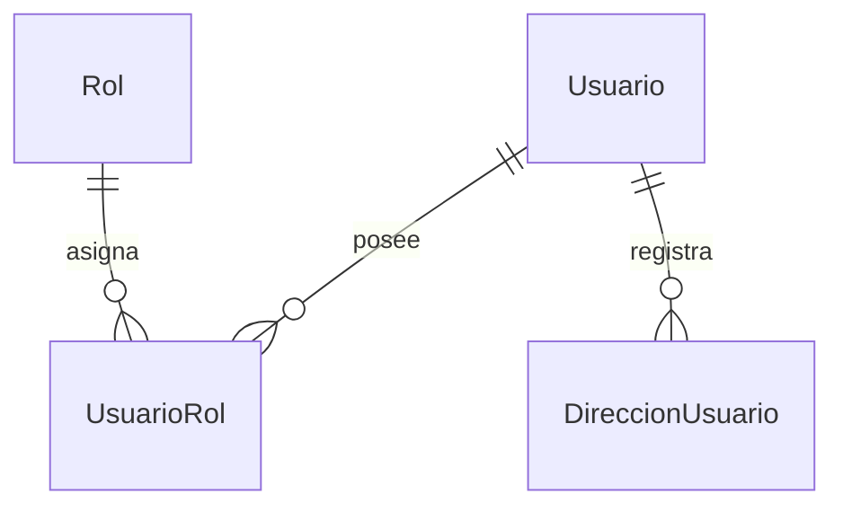

Relaciones:

* Usuario N ─── N Rol, mediante UsuarioRol.
* Usuario 1 ─── N DireccionUsuario.

---

# 3. Catálogo

## Categoria

* CategoriaId (PK)
* Nombre
* Descripcion
* Activa

## Producto

* ProductoId (PK)
* CategoriaId (FK)
* Nombre
* Descripcion
* Precio
* Stock
* Activo

## ComponentePC

* ProductoId (PK, FK)
* Marca
* Modelo

## Publicacion

* ProductoId (PK, FK)
* TipoPublicacion
* Autor
* Editorial
* ISBN
* Volumen

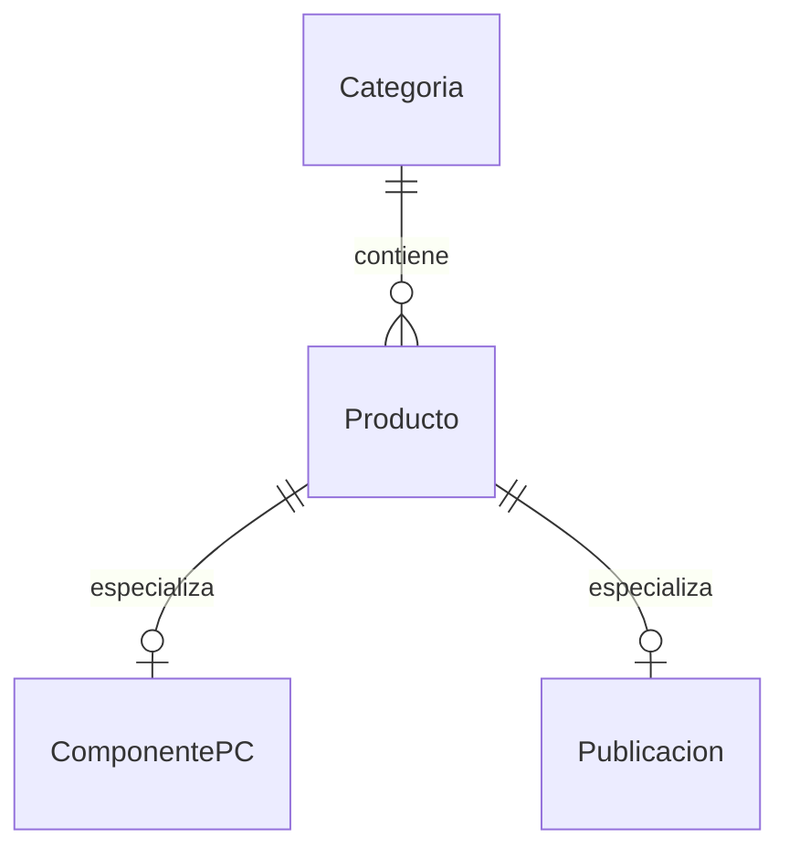

Relaciones:

* Categoria 1 ─── N Producto.
* Producto 1 ─── 0..1 ComponentePC.
* Producto 1 ─── 0..1 Publicacion.

Un producto especializado corresponde a una única rama del catálogo inicial.

---

# 4. Carrito de compra

## Carrito

* CarritoId (PK)
* UsuarioId (FK)
* Estado
* FechaCreacion
* FechaActualizacion

## DetalleCarrito

* DetalleCarritoId (PK)
* CarritoId (FK)
* ProductoId (FK)
* Cantidad

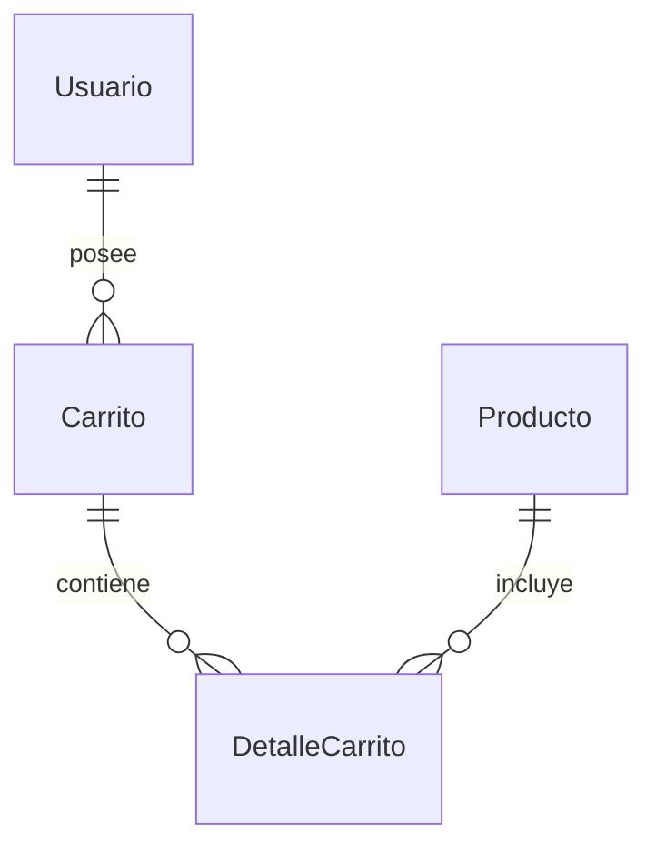

Relaciones:

* Usuario 1 ─── N Carrito.
* Carrito 1 ─── N DetalleCarrito.
* Producto 1 ─── N DetalleCarrito.

La combinación Carrito + Producto debe ser única.

---

# 5. Pedidos, entrega y pagos

## Pedido

* PedidoId (PK)
* UsuarioId (FK)
* Subtotal
* CostoEnvio
* Total
* Estado
* FechaPedido

## DireccionPedido

* DireccionPedidoId (PK)
* PedidoId (FK)
* NombreDestinatario
* Telefono
* LineaDireccion1
* LineaDireccion2
* Pais
* Region
* Provincia
* Distrito
* CodigoPostal
* Referencia

## DetallePedido

* DetallePedidoId (PK)
* PedidoId (FK)
* ProductoId (FK)
* Cantidad
* PrecioUnitario

## Pago

* PagoId (PK)
* PedidoId (FK)
* Monto
* Metodo
* Estado
* ReferenciaExterna
* FechaCreacion
* FechaPago

## HistorialPedido

* HistorialPedidoId (PK)
* PedidoId (FK)
* UsuarioId (FK, opcional)
* EstadoAnterior
* EstadoNuevo
* FechaCambio

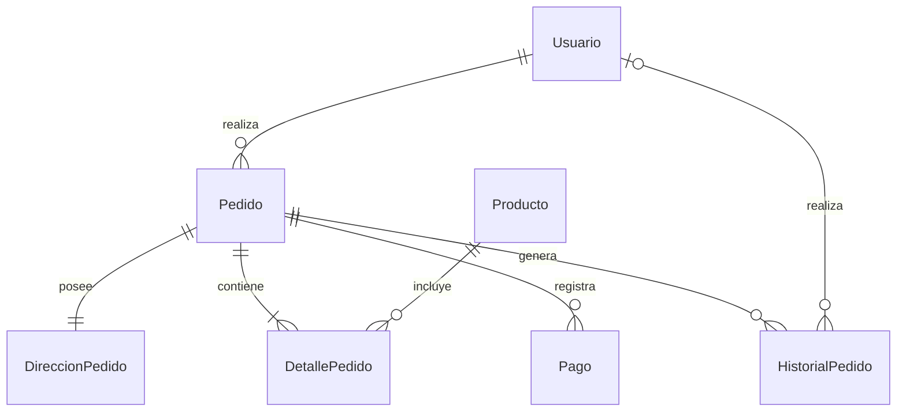

Relaciones:

* Usuario 1 ─── N Pedido.
* Pedido 1 ─── 1 DireccionPedido.
* Pedido 1 ─── N DetallePedido.
* Producto 1 ─── N DetallePedido.
* Pedido 1 ─── N Pago.
* Pedido 1 ─── N HistorialPedido.
* Usuario 0..1 ─── N HistorialPedido.

`DireccionPedido` conserva la dirección utilizada al confirmar la compra y no depende de cambios posteriores en `DireccionUsuario`.

---

# 6. Especialización de componentes de PC

## Procesador

* ProductoId (PK, FK)
* Socket
* TdpWatts
* ConsumoEstimadoWatts
* TieneGraficosIntegrados
* IncluyeRefrigeracion

## PlacaMadre

* ProductoId (PK, FK)
* Socket
* Chipset
* FormatoPlaca
* TipoMemoria
* CantidadSlotsMemoria
* CapacidadMaximaMemoriaGB
* CantidadSlotsM2
* CantidadPuertosSata
* ConsumoEstimadoWatts

## MemoriaRAM

* ProductoId (PK, FK)
* TipoMemoria
* CapacidadTotalGB
* ModulosPorKit
* FrecuenciaMTs
* ConsumoEstimadoWatts

## TarjetaGrafica

* ProductoId (PK, FK)
* LongitudMm
* ConsumoEstimadoWatts
* PotenciaFuenteRecomendadaWatts

## Almacenamiento

* ProductoId (PK, FK)
* TipoAlmacenamiento
* Interfaz
* CapacidadGB
* ConsumoEstimadoWatts

## FuentePoder

* ProductoId (PK, FK)
* PotenciaWatts
* FormatoFuente

## Gabinete

* ProductoId (PK, FK)
* LongitudMaximaGpuMm
* AlturaMaximaRefrigeracionMm

## Refrigeracion

* ProductoId (PK, FK)
* TipoRefrigeracion
* AlturaMm
* TamanoRadiadorMm
* ConsumoEstimadoWatts

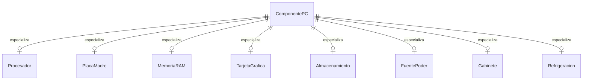

Cada `ComponentePC` corresponde exactamente a uno de estos subtipos.

---

# 7. Compatibilidad procesador y placa madre

## CompatibilidadProcesadorPlaca

* ProductoIdProcesador (PK, FK)
* ProductoIdPlacaMadre (PK, FK)
* RequiereActualizacionBios
* Observacion

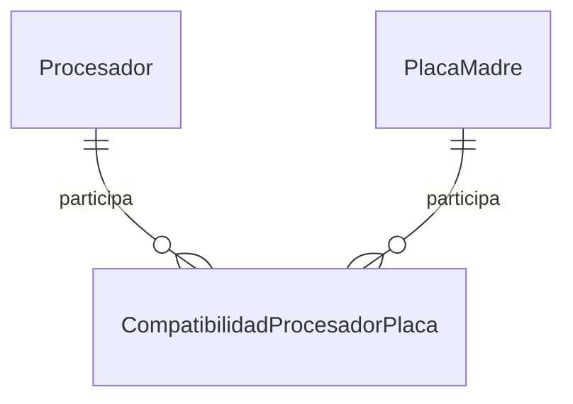

Relación conceptual:

Procesador N ─── N PlacaMadre

mediante `CompatibilidadProcesadorPlaca`.

La existencia de una combinación representa compatibilidad técnica conocida entre ambos componentes.

---

# 8. Compatibilidad del gabinete

## GabineteFormatoPlaca

* ProductoIdGabinete (PK, FK)
* FormatoPlaca (PK)

## GabineteFormatoFuente

* ProductoIdGabinete (PK, FK)
* FormatoFuente (PK)

## GabineteRadiadorSoportado

* ProductoIdGabinete (PK, FK)
* TamanoRadiadorMm (PK)

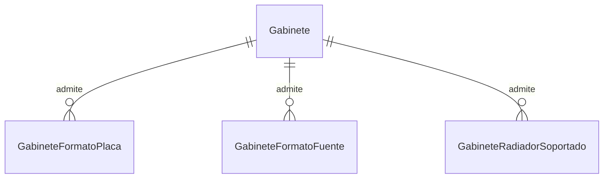

Relaciones:

* Gabinete 1 ─── N GabineteFormatoPlaca.
* Gabinete 1 ─── N GabineteFormatoFuente.
* Gabinete 1 ─── N GabineteRadiadorSoportado.

---

# 9. Compatibilidad de refrigeración

## RefrigeracionSocket

* ProductoIdRefrigeracion (PK, FK)
* Socket (PK)

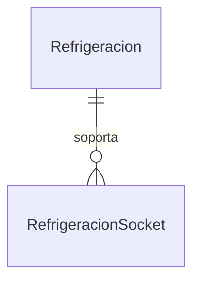

Relación:

Refrigeracion 1 ─── N RefrigeracionSocket.

---

# 10. Configuraciones de PC

## ConfiguracionPC

* ConfiguracionPCId (PK)
* UsuarioId (FK)
* Nombre
* EstadoCompatibilidad
* FechaCreacion
* FechaActualizacion
* FechaUltimaValidacion

## ConfiguracionPCItem

* ConfiguracionPCItemId (PK)
* ConfiguracionPCId (FK)
* ProductoId (FK)
* Cantidad

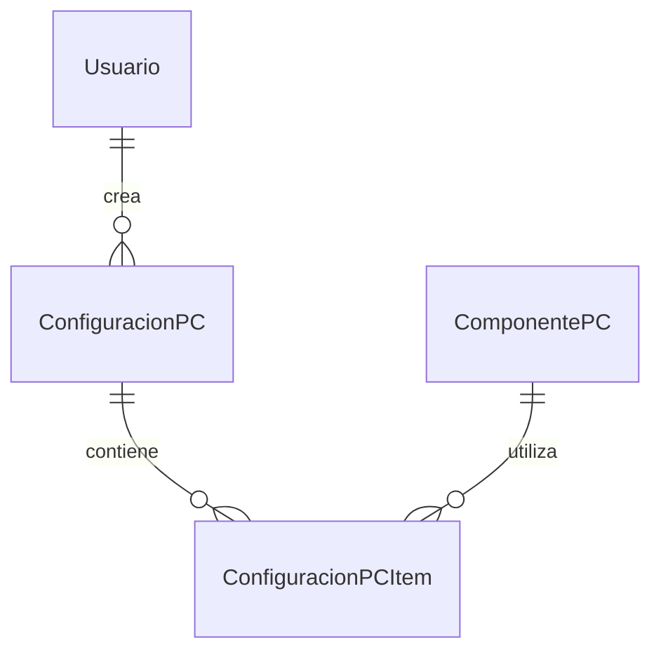

Relaciones:

* Usuario 1 ─── N ConfiguracionPC.
* ConfiguracionPC 1 ─── N ConfiguracionPCItem.
* ComponentePC 1 ─── N ConfiguracionPCItem.

La combinación ConfiguracionPC + ComponentePC debe ser única.

---

# 11. Videojuego

## Juego

* JuegoId (PK)
* Nombre
* Descripcion
* Estado
* FechaAnuncio
* FechaLanzamientoEstimada

## PersonajeJuego

* PersonajeId (PK)
* JuegoId (FK)
* Nombre
* Descripcion

## MapaJuego

* MapaId (PK)
* JuegoId (FK)
* Nombre
* Descripcion

## PreregistroJuego

* PreregistroId (PK)
* JuegoId (FK)
* UsuarioId (FK, opcional)
* Email
* FechaRegistro

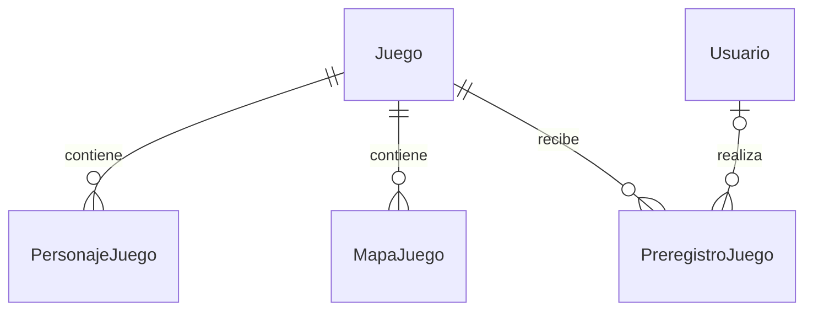

Relaciones:

* Juego 1 ─── N PersonajeJuego.
* Juego 1 ─── N MapaJuego.
* Juego 1 ─── N PreregistroJuego.
* Usuario 0..1 ─── N PreregistroJuego.

La combinación Juego + Email debe ser única.

---

# 12. Servicios de desarrollo

## ServicioDesarrollo

* ServicioId (PK)
* Nombre
* Descripcion
* PrecioBase
* Activo

## SolicitudServicio

* SolicitudId (PK)
* UsuarioId (FK)
* ServicioId (FK)
* DescripcionRequerimiento
* Estado
* FechaSolicitud

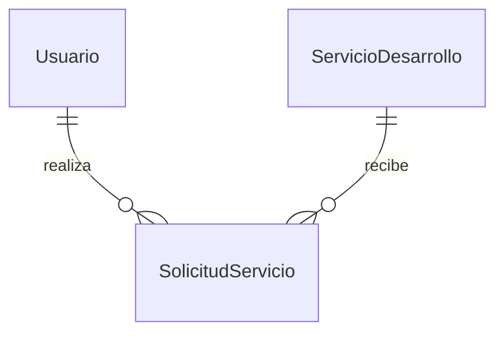

Relaciones:

* Usuario 1 ─── N SolicitudServicio.
* ServicioDesarrollo 1 ─── N SolicitudServicio.

---

# 13. Contenido corporativo

## Empresa

* EmpresaId (PK)
* Nombre
* Descripcion
* Mision
* Vision
* FechaCreacion
* Activa

Actualmente `Empresa` no requiere relaciones con otras entidades del dominio.

---

# 14. Resumen general de relaciones

Usuario N ─── N Rol
mediante UsuarioRol

Usuario 1 ─── N DireccionUsuario

Categoria 1 ─── N Producto

Producto 1 ─── 0..1 ComponentePC

Producto 1 ─── 0..1 Publicacion

Usuario 1 ─── N Carrito

Carrito 1 ─── N DetalleCarrito

Producto 1 ─── N DetalleCarrito

Usuario 1 ─── N Pedido

Pedido 1 ─── 1 DireccionPedido

Pedido 1 ─── N DetallePedido

Producto 1 ─── N DetallePedido

Pedido 1 ─── N Pago

Pedido 1 ─── N HistorialPedido

Usuario 0..1 ─── N HistorialPedido

ComponentePC 1 ─── 0..1 Procesador

ComponentePC 1 ─── 0..1 PlacaMadre

ComponentePC 1 ─── 0..1 MemoriaRAM

ComponentePC 1 ─── 0..1 TarjetaGrafica

ComponentePC 1 ─── 0..1 Almacenamiento

ComponentePC 1 ─── 0..1 FuentePoder

ComponentePC 1 ─── 0..1 Gabinete

ComponentePC 1 ─── 0..1 Refrigeracion

Procesador N ─── N PlacaMadre
mediante CompatibilidadProcesadorPlaca

Gabinete 1 ─── N GabineteFormatoPlaca

Gabinete 1 ─── N GabineteFormatoFuente

Gabinete 1 ─── N GabineteRadiadorSoportado

Refrigeracion 1 ─── N RefrigeracionSocket

Usuario 1 ─── N ConfiguracionPC

ConfiguracionPC 1 ─── N ConfiguracionPCItem

ComponentePC 1 ─── N ConfiguracionPCItem

Juego 1 ─── N PersonajeJuego

Juego 1 ─── N MapaJuego

Juego 1 ─── N PreregistroJuego

Usuario 0..1 ─── N PreregistroJuego

Usuario 1 ─── N SolicitudServicio

ServicioDesarrollo 1 ─── N SolicitudServicio

---

# 15. Estado del modelo

El modelo entidad–relación v1.0 define las entidades, atributos, claves y cardinalidades necesarias para representar el dominio inicial de NGT Platform.

El siguiente nivel corresponde al **modelo físico de la base de datos**, donde se definirán tipos de datos, nulabilidad, restricciones, índices y demás características específicas de SQL Server.
